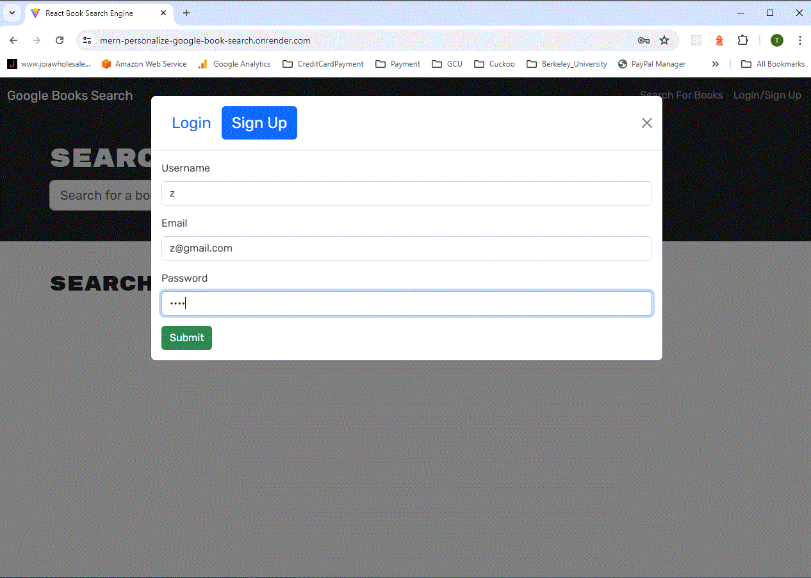
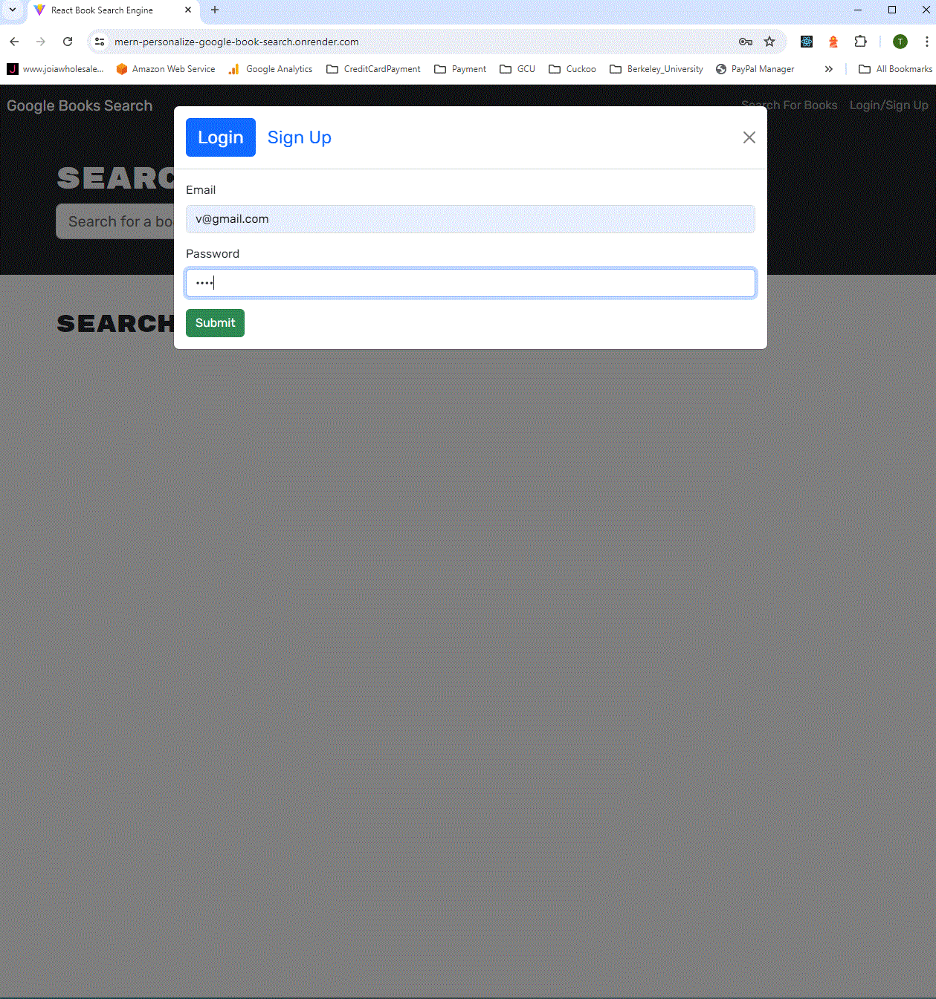
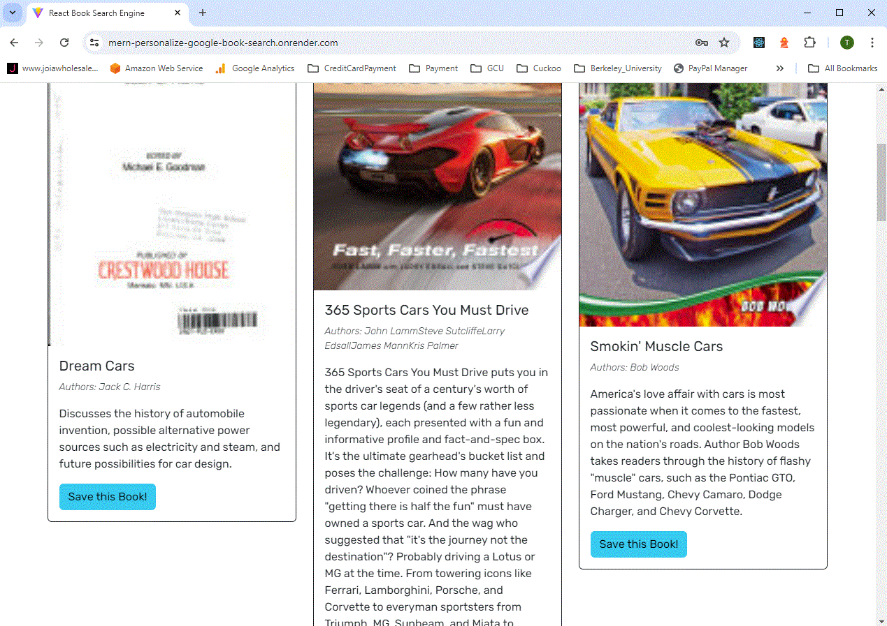
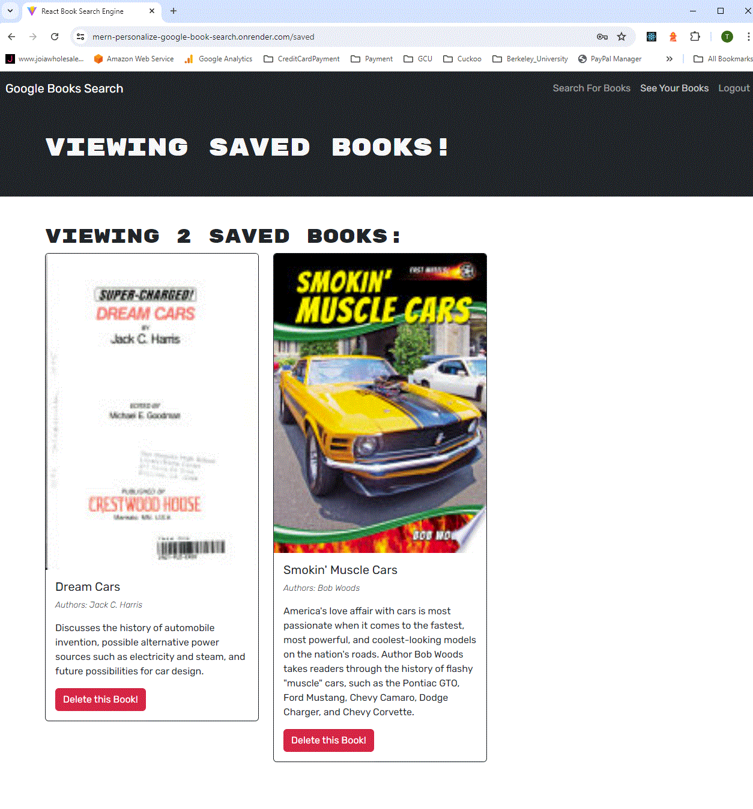

# MERN
What This App Does
This app is like a super cool personalized Google Book Search Engine. It lets you search for books and save the ones you like. Here’s what it does:

Front-End Stuff (What You See)
React: It’s a tool that helps build websites. Think of it like digital Lego blocks to create web pages.
React Router: This is like a GPS for websites, helping you move from one page to another.
Apollo Client: This helps manage data from both your computer and the internet using GraphQL.
Bootstrap: It’s a bunch of pre-made website designs that make everything look pretty.
React Bootstrap: This makes it easy to use Bootstrap with React, like combining two awesome things together.
JWT-Decode: A little tool that helps read special tokens used to keep you logged in.

Back-End Stuff (What You Don’t See)
Node.js: It lets you run JavaScript on your computer, not just in your web browser.
Express: This helps build the behind-the-scenes parts of websites.
Apollo Server: It works with GraphQL to manage all the data you need.
MongoDB: A super flexible database where we store all the book and user info.
Mongoose: This helps manage MongoDB, making sure everything is in the right place and working correctly.
bcryptjs: It’s like a super password protector, keeping your passwords safe.

How It Works
Sign Up: Create an account with a username, email, and password. Your password is safely stored with bcryptjs.
Log In: Use your email and password to log in. A special token (JWT) keeps you logged in.
Search Books: Look up books using the Google Books API. You’ll see the title, author, description, and cover image.
Save Books: If you like a book, you can save it to your list. This is stored in MongoDB.
View Saved Books: See all the books you’ve saved in one place.
Remove Books: Don’t like a book anymore? Remove it from your saved list.
This app makes searching for and managing your favorite books super easy and fun!

